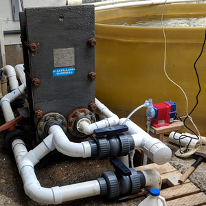
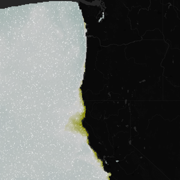
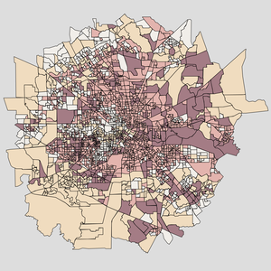
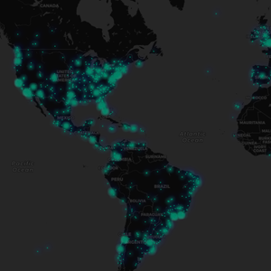
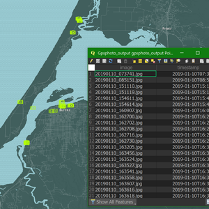

# Brian G. Katz GitHub Atlas
### Repositories Featured:

- #### [OA Mapping Tool](https://briangkatz.github.io/oa/vulnerability/pnw)

  - Mapping species responses to modeled ocean acidification hotspots in the Pacific Northwest

  

- #### [OA Vulnerability](https://briangkatz.github.io/oa/vulnerability/)

  - Assessing vulnerability of shellfish stakeholders to ocean acidification in the Pacific Northwest

  

- #### [OA Adaptation](https://briangkatz.github.io/oa/adaptation/)

  - A case study of successful adaptation to ocean acidification in the Pacific Northwest

  

- #### [OA Background](https://briangkatz.github.io/oa/background)

  - Background on shellfish-dependent livelihoods and ocean acidification in the Pacific Northwest

  

- #### [OA Exposure](https://briangkatz.github.io/oa-exposure/)

  - Interannual OA extremes in the Pacific Northwest (&Omega;ar<=1.4)

  

- #### [Vector Field Animation](https://briangkatz.github.io/vector-field-animation/)

  - Vector animation of raster data
  - Utilizes Leaflet.CanvasLayer.Field from [IHCantabria](https://github.com/IHCantabria/Leaflet.CanvasLayer.Field)

  

- #### [Hurricane Harvey](https://briangkatz.github.io/harvey/)

  - Mapping Houston census tracts by exposure and adaptive capacity to flooding from Harvey

  

- #### [Real-time Tweet Stream](https://realtime-tweet-stream.herokuapp.com/)

  - Streaming global tweet locations on a map in near real-time
  - [Tutorial](https://www.github.com/briangkatz/realtime-tweets/)

  

- #### [GPS Photos to GeoJSON](https://briangkatz.github.io/gps-photos-to-geojson/)

  - Converting a directory of georeferenced photos into geospatial data

  

- #### [U.S. Oil Imports](https://briangkatz.github.io/petro)

  - Flow map of petroleum product imports into U.S. ports in 2019

    

- #### [U.S. Airports](https://briangkatz.github.io/airports/)

  - Map of airports in the United States

  

- #### [NYC Noise Complaints](https://briangkatz.github.io/noise/)

  - 3D map of noise complaints in NYC
  
  
